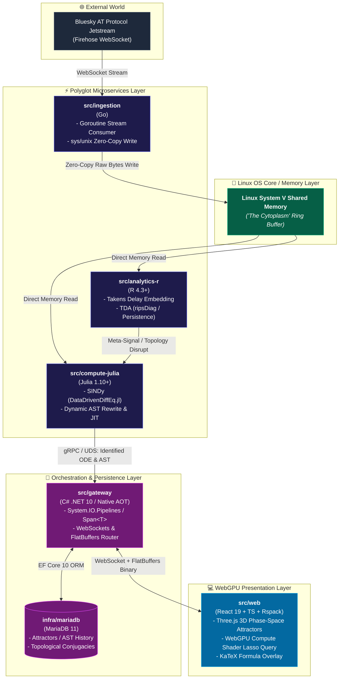
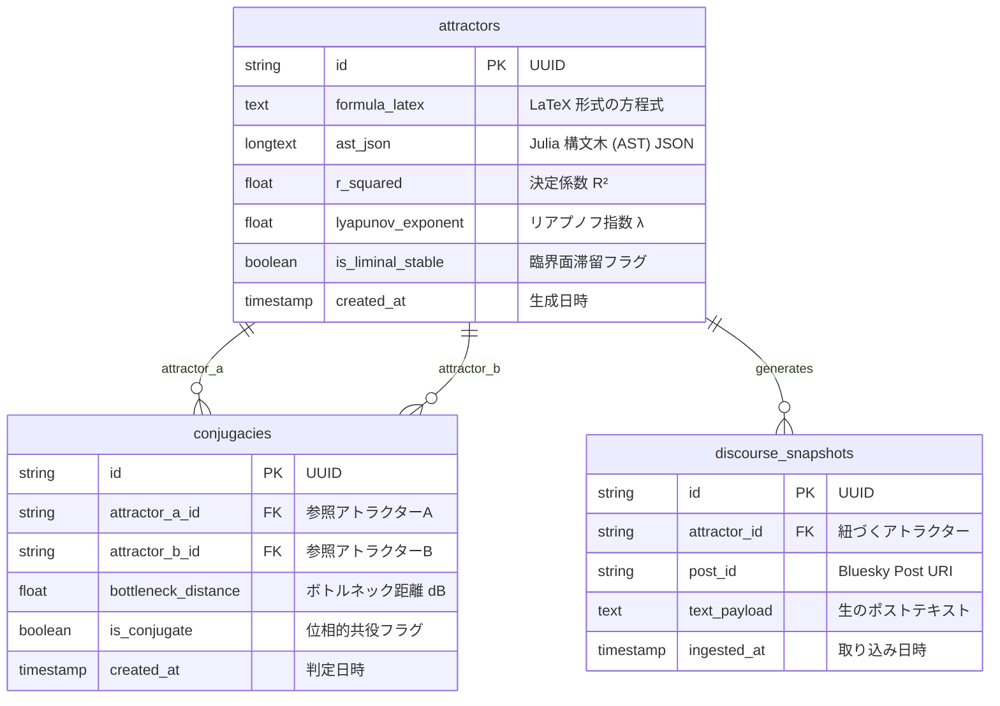

# 🏛️ CONCEPT ARCHITECTURE DIAGRAMS: A P E I R O N

---

## 1. 全体システムアーキテクチャ図（System Block Architecture）



---

## 2. データフロー ＆ リアルタイム処理シーケンス（End-to-End Sequence）

```mermaid
sequenceDiagram
    autonumber
    actor User as 👤 User Browser
    participant FE as src/web (WebGPU)
    participant GW as src/gateway (C# .NET 10)
    participant ING as src/ingestion (Go)
    participant SHM as Shared Memory (IPC)
    participant R as src/analytics-r (R)
    participant JUL as src/compute-julia (Julia)
    participant DB as MariaDB

    rect rgb(20, 30, 45)
        note over ING, SHM: Phase 1: High-Throughput Stream Ingestion
        ING->>ING: Receive Jetstream WebSocket Frame
        ING->>SHM: Write Raw Byte Stream to Ring Buffer (Zero-Copy)
    end

    rect rgb(35, 20, 45)
        note over SHM, JUL: Phase 2: Autonomous Topological Computing
        R->>SHM: Read Ring Buffer State
        R->>R: Takens Delay Embedding & TDA (ripsDiag)
        alt Topological Disruption Detected
            R->>JUL: Send Meta-Signal (Rewrite Trigger)
            JUL->>SHM: Read State Matrix X & X_dot
            JUL->>JUL: Run SINDy + Dynamic AST Rewrite (SymbolicUtils.jl)
            JUL->>GW: Push Identified ODE System (LaTeX / AST)
            GW->>DB: Save Attractor & Formula Parameters
            GW->>FE: Stream New Phase-Space Field (FlatBuffers)
        end
    end

    rect rgb(20, 45, 45)
        note over User, JUL: Phase 3: Interactive WebGPU Lasso Query
        User->>FE: Freehand Lasso Draw on 3D Canvas
        FE->>FE: WebGPU Compute Shader Intersection Query (<2ms)
        FE->>GW: Request Local ODE Identification (Point Cloud Segment)
        GW->>JUL: Proxy Sub-Matrix SINDy Request
        JUL->>JUL: Rapid STLSQ Regression on Selected Local Region
        JUL-->>GW: Return Local Equation
        GW-->>FE: Render KaTeX Formula Overlay Card
    end
```



---

## 3. 二重力学系・自律創出（Autopoiesis）メタループ概念図

```mermaid
graph LR
    subgraph MicroDynamical ["1. ミクロ力学系 (Micro State Trajectory)"]
        direction TB
        X["状態ベクトル <b>x(t)</b><br/>(言説空間における軌跡)"]
        ODE["微分方程式<br/><b>dx/dt = f(x) + M * g(x) + xi(t)</b>"]
        X --> ODE -->|時間発展| X
    end

    subgraph TransitionBoundary ["2. 相転移境界 (Liminal Boundary)"]
        LAMBDA["リアプノフ指数 <b>lambda ≈ 0</b><br/>(秩序とカオスの境界滞留)"]
    end

    subgraph MetaDynamical ["3. メタ力学系 (Meta Structural Evolution)"]
        direction TB
        TDA["TDA 位相データ解析<br/>(0次・1次永続ホモロジー)"]
        AST["AST 構文木動的挿入<br/>(SymbolicUtils.jl JIT)"]
        TDA -->|破綻シグナル| AST
    end

    %% Interactions
    MicroDynamical -->|時系列データ供給| MetaDynamical
    MetaDynamical -->|方程式 f(x) の動的再構築| MicroDynamical
    MicroDynamical -.->|引き戻し制御| TransitionBoundary
    MetaDynamical -.->|解の自己固着を無効化| TransitionBoundary

    classDef micro fill:#1e3a8a,stroke:#3b82f6,color:#fff;
    classDef meta fill:#581c87,stroke:#a855f7,color:#fff;
    classDef liminal fill:#064e3b,stroke:#10b981,color:#fff;

    class MicroDynamical micro;
    class MetaDynamical meta;
    class TransitionBoundary liminal;
```

---

## 4. Linux 共有メモリ（"The Cytoplasm"）メモリレイアウト図

```text
+-----------------------------------------------------------------------------------+
|                   Linux System V Shared Memory Segment ("The Cytoplasm")          |
+-----------------------------------------------------------------------------------+
| [ Header Segment ] (64 Bytes)                                                     |
|  ├── Magic Byte       : 0x41504549 ("APEI")                                       |
|  ├── Write Index      : uint64 (Atomic Pointer updated by Go)                     |
|  ├── Read Index (R)   : uint64 (Updated by R Worker)                              |
|  └── Read Index (Jul) : uint64 (Updated by Julia Worker)                          |
+-----------------------------------------------------------------------------------+
| [ Ring Buffer Segment ] (Primary Stream Channel - 128 MB Circular)                 |
|  ├── Block 0001: [ Timestamp | PostID (16B) | Embedding Matrix (128xFloat32) ]     |
|  ├── Block 0002: [ Timestamp | PostID (16B) | Embedding Matrix (128xFloat32) ]     |
|  ├── ...                                                                          |
|  └── Block NNNN: [ Lockless Ring Slot ]                                           |
+-----------------------------------------------------------------------------------+
| [ Meta-Signal & Control Bus ] (4 MB Shared Memory IPC Flags)                      |
|  ├── Flag_TDA_Disruption  : bool (R -> Julia: AST Rewrite Trigger)                |
|  ├── Flag_SINDy_Updated   : bool (Julia -> C# Gateway: New Formula Ready)         |
|  └── Shared_Matrix_X_dot  : Direct Memory Buffer for Differential Reconstruction   |
+-----------------------------------------------------------------------------------+
```

---

## 5. ドメイン・エンティティ関係図（MariaDB ERD）


